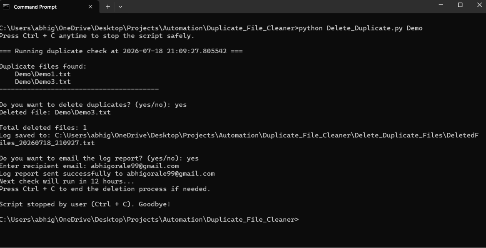

# 🗂️ Duplicate File Cleaner & Log Automation

A Python-based automation script to **detect and delete duplicate files** from a directory on a scheduled basis.  
The system generates **timestamped log files** of all operations and can automatically **email the logs** for audit purposes.

---

## ✨ Features
- 🔍 **Checksum-based detection** using `hashlib (MD5)` to identify duplicate files.
- 🗑️ **Safe deletion**: keeps one copy of each file, deletes the rest.
- 📝 **Automated log generation** with timestamped `.txt` reports.
- 📂 **Organized history**: all logs stored in a dedicated `Delete_Duplicate_Files` folder.
- 📧 **Email integration**: sends log files as attachments via SMTP.
- ⏱️ **Periodic execution**: runs automatically every 12 hours.
- 🛑 **Graceful exit**: press `Ctrl + C` to stop safely.

---

## 🛠️ Tech Stack
- **Python 3**
- `os` – directory and file handling  
- `hashlib` – checksum calculation (MD5)  
- `smtplib` – email automation  
- `datetime` – timestamped logs  
- `time` – scheduling loop  

---

## 📂 Project Structure

```
python-programming/
│
├── automation/
│   | ── Duplicate_File_Cleaner/
│   │   ├── duplicate_cleaner.py
│   │   ├── Delete_Duplicate_Files/        # auto-created logs folder
│   │   ├── example_log.txt                # sample log file
│   │   ├── README.md
│   │   ├── requirements.txt
│   │   ├── .gitignore
│   │   └── LICENSE
```

---

## 📸 Demo Output



## Delete_Duplicate_Files:
Delete_Duplicate_Files/DeletedFiles_20260718_210927.txt


## ⚙️ Setup & Usage

Configure email credentials
Open duplicate_cleaner.py and set:

SENDER_EMAIL = "your_email@gmail.com"
SENDER_PASSWORD = "your_app_password" 

⚠️ For Gmail, generate an App Password under account security settings.

Run the script :

python Delete_Duplicate.py <FolderName>

## 🛠️Behavior

Scans the given folder for duplicates.

Deletes duplicates after confirmation.

Creates a timestamped .txt log in Delete_Duplicate_Files/.

Optionally emails the log file to a recipient.

Repeats automatically every 12 hours.

Stop anytime with Ctrl + C.

## 📧 Email Notes

Works with Gmail by default (smtp.gmail.com, port 587).

For Outlook/Yahoo, update SMTP_SERVER and SMTP_PORT.

Logs are sent as .txt attachments for easy viewing.

## 🚀 Future Improvements

Add configurable scheduling interval (e.g., 6h, 24h).

Add support for multiple directories.

Auto-clean old logs (keep last N reports).

## 👨‍💻 Author

## Developed by Abhijeet Gorale
## GitHub: https://github.com/AbhijeetGorale


